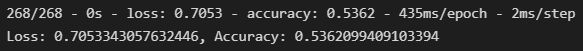
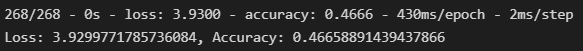
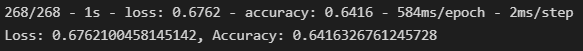
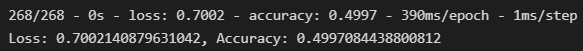

# **Neural Network Charity Analysis**

## **Objective**
The purpose of the analysis is to use historical charity donations and their percieved success or failure as an indicator of whether a future investment should be made leveraging neural networks.

## **Results**
 Data Pre-Processing
 - The variable that was the target for my analysis was the IS_SUCCESSFUL column.
 - The variables retained as the features of my analysis were
    - APPLICATION_TYPE
    - AFFILIATION
    - CLASSIFICATION
    - USE_CASE
    - ORGANIZATION
    - STATUS
    - INCOME_AMOUNT
    - SPECIAL_CONSIDERATIONS
    - ASK_AMOUNT
 - The variables removed as features from my analysis were EIN and NAME columns.

Compiling, Training and Evaluating the Model
- There were 2 hidden layers with 10 nodes in the first layer and 4 nodes in the second layer. Both of these hidden layers leveraged the relu activation function. A final layer was added with one node leveraging the sigmoid activation method.
- I was unable to achieve target model performance reaching only 53.62% accuracy.

- Optimizations
    - In the first optimization, I increased the nodes in the second hidden layer to 6 while maintaining the activation functions. This optimization actually worsened performance to 46.65% accuracy.
    
    - In the second optimization, I added a third hidden layer while also increasing the nodes for each of the previous hidden layers. The first layer had 14 nodes now, the second layer had 8 nodes now, and the new third layer had 2 nodes. Each leveraging the relu activation method. This optimization improved performance to 64.16% accuracy, what would be the best performance of any optimization tested.
    
    - In the final optimization, I added more nodes to the third layer, now at 4 total, while also changing the activation function of the third layer to Tanh. Here again the performance worsened to 49.97% accuracy.
    
 

## **Summary**
In summary the 75% target accuracy for the model was not achieved, although significant progress was achieved by adding a third hidden layer and increasing the nodes across each of the hidden layers. My reccomendation would be to consider increasing nodes across each of the hidden layers even more or adding another hidden layer to attempt an increased accuracy for the model.